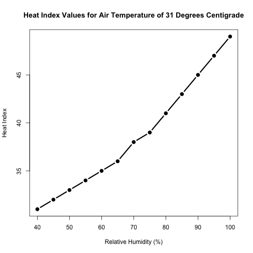

Heat Index Calculator and Fluid Intake Compensation Guide
========================================================
author: Developing Data Products Project
date: September 20, 2015

What is the Heat Index?
========================================================

The heat index (also known as humiture or humidex) is an index that combines air temperature and relative humidity in an attempt to determine the human-perceived equivalent temperature. 

Because the human body cools itself by persperation and high humidity reduces the evaporation of that persperation, a warm temperature coupled with high humidity can feel hotter than the same temperature and lower humidity.

The heat index was first developed by George Winterling in 1978 and was adopted by the the United States' National Weather Service in 1979. 

The heat index figures are based on temperature measurements taken in the shade, so extra care must be taken while in the sun.

How is the Heat Index Calculated?
========================================================

The heat index is defined so as to equal the actual air temperature when the partial pressure of water vapor is equal to a baseline value of 1.6 kPa. 

For T = Temperature (in degrees Fahrenheit) and rh = relative humidity (%), the formula to calculate the heat index is as follows:

Heat Index = -42.379 + (2.04901523 x T) + (10.14333127 x rh) - (.22475541 x T x rh) - (6.83783 x 10^-3 x T^2) - (5.481717 x 10^-2 x rh^2) + (1.22874 x 10^-3 x T^2 x rh) + (8.5282  x 10^-4 x T x rh^2) - (1.99 x 10^-6 x T^2 x rh^2)

Effect of Relative Humidity on Perceived Temperature
========================================================

Holding temperature constant, the following graph illustrates how changes in  relative humidity effect the heat index:

 

Notes on Fluid Intake Compensation Guide
========================================================

The app inludes a fluid intake compensation guide, which is a series of recommendations on how much of varying types of liquids you might consider drinking in order to stay cool for various heat index figures. 

Please note that these recommendations are based solely on my own personal experience - as such, consider using these recommendations as a starting point and then adjust the type and/or amount of liquid to be ingested in order to achieve optimum cooling for your particular situation. 

In short - when it gets hot, do what you gotta do to stay cool (but not too cool)!
